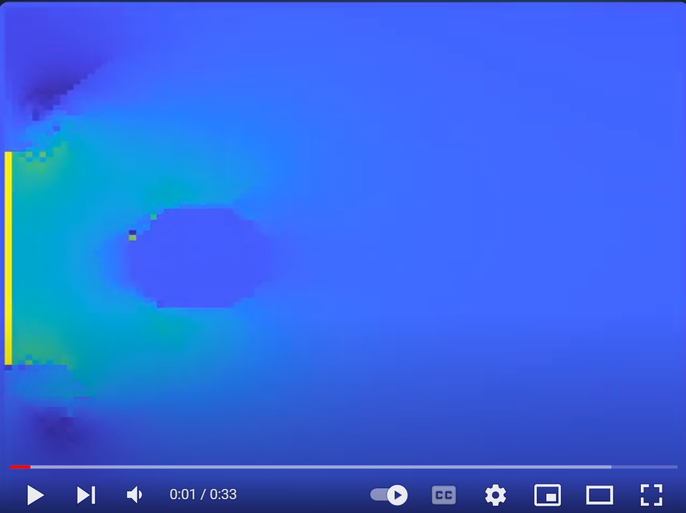

# TinyCompanion

## Euler Fluid Simulation:

### without solid constraint

| collision 1                                                     | collision 2                                                      |
| --------------------------------------------------------------- | ---------------------------------------------------------------- |
|  |  |

### with solid constraint

Since the low resolution, the Kármán vortex street is not obvious.

| v = 0.5m/s                                                       | v = 5m/s                                                         |
| ---------------------------------------------------------------- | ---------------------------------------------------------------- |
|  |  |

Click below plot to see the full video(v = 1m/s):
* [[bilibili]](https://www.bilibili.com/video/BV18j421R7jg/?spm_id_from=333.1007.top_right_bar_window_history.content.click) 
* [[youtube]](https://www.youtube.com/watch?v=9mzt6BXnCXA)

